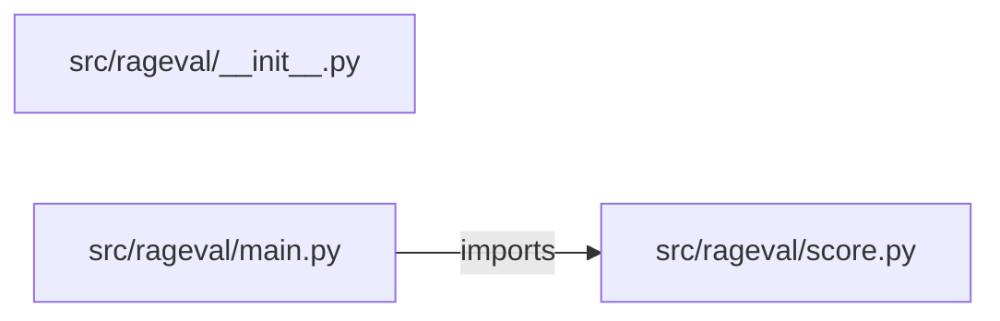

# rag-evaluation-platform — project architecture

[README](README.md) · [Interview questions and answers](INTERVIEW_QA.md)

## Purpose and scope

Scores a RAG answer against its retrieved contexts and a gold answer, using word overlap after removing stop words and a trailing plural `s`. It does not call a model, so a score never changes between runs.

This document describes files and symbols in this checkout. Deployment templates and statements in the original overview are distinguished from a verified running environment.

## Component diagram



For Python repositories, arrows show resolved local imports, not network calls or deployment order. Otherwise the diagram is a repository component map; containment arrows do not assert runtime integration.

## Components and responsibilities

| Component | Responsibility |
| --- | --- |
| [`src/rageval/main.py`](src/rageval/main.py) | HTTP handlers: `GET /healthz`, `GET /metrics`, `POST /evaluate`, `POST /evaluate/batch`, `POST /gate` |
| [`src/rageval/score.py`](src/rageval/score.py) | Functions: `stem`, `words`, `ratio`, `context_precision`, `check_citations`, `evaluate`, `evaluate_batch` |
| [`requirements.txt`](requirements.txt) | Implementation or supporting configuration |
| [`src/rageval/__init__.py`](src/rageval/__init__.py) | Implementation or supporting configuration |
| [`tests/test_eval.py`](tests/test_eval.py) | Executable checks and regression examples |
| [`.github/workflows/ci.yml`](.github/workflows/ci.yml) | GitHub Actions job definitions |
| [`README.md`](README.md) | Project explanations or operating notes |

## Request interface

| Method and path | Handler | Source |
| --- | --- | --- |
| `GET /healthz` | `healthz` | [`src/rageval/main.py`](src/rageval/main.py#L16) |
| `GET /metrics` | `metrics` | [`src/rageval/main.py`](src/rageval/main.py#L21) |
| `POST /evaluate` | `post_evaluate` | [`src/rageval/main.py`](src/rageval/main.py#L26) |
| `POST /evaluate/batch` | `post_batch` | [`src/rageval/main.py`](src/rageval/main.py#L38) |
| `POST /gate` | `post_gate` | [`src/rageval/main.py`](src/rageval/main.py#L43) |

The table lists literal route decorators found in the inspected Python modules. Router prefixes and middleware can add behavior; check the linked handler and application setup before calling an endpoint.

## Implementation walkthrough

### `evaluate(answer, gold, context, require_citations=False, thresholds=None)`

Source: [`src/rageval/score.py`](src/rageval/score.py#L50).

Calls visible in this function: `EvalError`, `all`, `check_citations`, `context_precision`, `failed.append`, `isinstance`, `limits.items`, `ratio`, `round`, `scores.items`, `set`, `set().union`.

```python
def evaluate(answer, gold, context, require_citations=False, thresholds=None):
    for name, value in (("answer", answer), ("gold", gold)):
        if not isinstance(value, str) or not value.strip():
            raise EvalError(f"{name} must be a non-empty string")
    contexts = [context] if isinstance(context, str) else context
    if not isinstance(contexts, list) or not contexts or not all(isinstance(c, str) for c in contexts):
        raise EvalError("context must be a string or a non-empty list of strings")
    limits = {**DEFAULT_THRESHOLDS, **(thresholds or {})}
    for name, value in limits.items():
        if name not in METRICS or not isinstance(value, (int, float)) or not 0 <= value <= 1:
            raise EvalError(f"threshold {name} must be a known metric with a value from 0 to 1")

    answer_words = words(answer)
    gold_words = words(gold)
    context_words = set().union(*(words(c) for c in contexts))
    scores = {
        "faithfulness": ratio(context_words, answer_words),
        "correctness": ratio(answer_words, gold_words),
        "context_precision": context_precision(gold_words, contexts),
        "context_recall": ratio(context_words, gold_words),
    }
    citations_valid, citation_problems = check_citations(answer, contexts, require_citations)
```

The excerpt is truncated; the linked source contains the full implementation.

### `evaluate_batch(cases, thresholds=None)`

Source: [`src/rageval/score.py`](src/rageval/score.py#L84).

Calls visible in this function: `EvalError`, `all`, `case.get`, `evaluate`, `isinstance`, `len`, `results.append`, `round`, `set`, `sum`.

```python
def evaluate_batch(cases, thresholds=None):
    if not isinstance(cases, list) or not 1 <= len(cases) <= 500:
        raise EvalError("cases must be a list of 1 to 500 items")
    ids = [case.get("id") if isinstance(case, dict) else None for case in cases]
    if not all(isinstance(case_id, str) and case_id for case_id in ids):
        raise EvalError("every case needs a string id")
    if len(set(ids)) != len(ids):
        raise EvalError("case ids must be unique")
    results = []
    for case in cases:
        result = evaluate(case.get("answer"), case.get("gold"), case.get("contexts", case.get("context")), case.get("require_citations", False), thresholds)
        results.append({"id": case["id"], **result})
    summary = {name: round(sum(r[name] for r in results) / len(results), 4) for name in METRICS}
    summary["pass_rate"] = round(sum(r["passed"] for r in results) / len(results), 4)
    return {"results": results, "summary": summary, "failing": [r["id"] for r in results if not r["passed"]]}
```

### `gate(summary, baseline, tolerance=0.05)`

Source: [`src/rageval/score.py`](src/rageval/score.py#L101).

Calls visible in this function: `EvalError`, `baseline.items`, `isinstance`, `regressions.append`, `round`.

```python
def gate(summary, baseline, tolerance=0.05):
    if not isinstance(tolerance, (int, float)) or not 0 <= tolerance <= 1:
        raise EvalError("tolerance must be from 0 to 1")
    if not isinstance(baseline, dict) or not baseline:
        raise EvalError("baseline must map metric names to values")
    regressions = []
    for name, before in baseline.items():
        if name not in summary:
            raise EvalError(f"unknown baseline metric: {name}")
        after = summary[name]
        if after < before - tolerance:
            regressions.append({"metric": name, "baseline": before, "candidate": after, "drop": round(before - after, 4)})
    return {"passed": not regressions, "regressions": regressions, "tolerance": tolerance}
```

### `check_citations(answer, contexts, required)`

Source: [`src/rageval/score.py`](src/rageval/score.py#L36).

Calls visible in this function: `MARKER.findall`, `int`, `len`, `problems.append`, `set`, `sorted`, `words`.

```python
def check_citations(answer, contexts, required):
    cited = [int(number) for number in MARKER.findall(answer)]
    if not cited:
        return (False if required else None), []
    problems = []
    answer_words = words(answer)
    for number in sorted(set(cited)):
        if not 1 <= number <= len(contexts):
            problems.append(f"[{number}] does not match a context")
        elif len(answer_words & words(contexts[number - 1])) < 2:
            problems.append(f"[{number}] does not support the answer")
    return not problems, problems
```

## Validation and failure paths

| Explicit exception | Source |
| --- | --- |
| `HTTPException(status_code=422, detail=str(exc))` | [`src/rageval/main.py`](src/rageval/main.py#L12) |
| `EvalError('context must be a string or a non-empty list of strings')` | [`src/rageval/score.py`](src/rageval/score.py#L56) |
| `EvalError('cases must be a list of 1 to 500 items')` | [`src/rageval/score.py`](src/rageval/score.py#L86) |
| `EvalError('every case needs a string id')` | [`src/rageval/score.py`](src/rageval/score.py#L89) |
| `EvalError('case ids must be unique')` | [`src/rageval/score.py`](src/rageval/score.py#L91) |
| `EvalError('tolerance must be from 0 to 1')` | [`src/rageval/score.py`](src/rageval/score.py#L103) |
| `EvalError('baseline must map metric names to values')` | [`src/rageval/score.py`](src/rageval/score.py#L105) |
| `EvalError(f'{name} must be a non-empty string')` | [`src/rageval/score.py`](src/rageval/score.py#L53) |
| `EvalError(f'threshold {name} must be a known metric with a value from 0 to 1')` | [`src/rageval/score.py`](src/rageval/score.py#L60) |
| `EvalError(f'unknown baseline metric: {name}')` | [`src/rageval/score.py`](src/rageval/score.py#L109) |

These are explicit exceptions in the inspected source, rather than a claim that every failure is handled. Follow the calling handler to see whether the exception becomes an HTTP response or propagates.

## Data and state

- [`src/rageval/score.py`](src/rageval/score.py) defines module-level containers: `STOP`, `DEFAULT_THRESHOLDS`.

Module-level dictionaries/lists live in a Python process. They can be fixtures or mutable state; inspect writes before treating them as persistent storage. A production extension would need to define persistence and concurrency behavior explicitly.

## Data flow and design decisions

### What is the input-to-output contract of `evaluate`

In [`src/rageval/score.py`](src/rageval/score.py#L50), `evaluate(answer, gold, context, require_citations=False, thresholds=None)` receives the inputs. The function computes these intermediate values:

- `contexts = [context] if isinstance(context, str) else context`
- `limits = {**DEFAULT_THRESHOLDS, **(thresholds or {})}`
- `answer_words = words(answer)`
- `gold_words = words(gold)`
- `context_words = set().union(*(words(c) for c in contexts))`
- `scores = {'faithfulness': ratio(context_words, answer_words), 'correctness': ratio(answer_words, gold_words), 'context_precision': context_precision(gold_words, contexts), 'context_recall': ratio(context_words, gold_words)}`
- `citations_valid, citation_problems = check_citations(answer, contexts, require_citations)`

Its result is defined by:

- `{**{name: round(value, 4) for name, value in scores.items()}, 'citations_valid': citations_valid, 'citation_problems': citation_problems, 'failed': failed, 'passed': not failed}`

### Which decision rules or boundary conditions should an interviewer challenge

The implementation in [`src/rageval/score.py`](src/rageval/score.py#L50) branches on:

- `not isinstance(contexts, list) or not contexts or (not all((isinstance(c, str) for c in contexts)))`
- `citations_valid is False`
- `not isinstance(value, str) or not value.strip()`
- `name not in METRICS or not isinstance(value, (int, float)) or (not 0 <= value <= 1)`

A useful extension is a table-driven test that covers each condition just below, at, and above its boundary where applicable. These expressions are the current rules; changing them changes behavior and should be justified by the project’s acceptance criteria.

## Setup and verification

The following commands are derived from the checked-in dependency/test contracts. Execute them from the repository root; the block prepares a local environment, not a cloud deployment.

```bash
python3 -m venv .venv
source .venv/bin/activate
python -m pip install -r requirements.txt
python -m pytest -q
```

Python dependencies: [`requirements.txt`](requirements.txt).

Test entry points: [`tests/test_eval.py`](tests/test_eval.py).

Automation definitions: [`.github/workflows/ci.yml`](.github/workflows/ci.yml). Read their triggers and job steps to determine what CI actually runs.

## Operating boundaries and design review

Before turning this checkout into a customer deployment, establish the input contract, data ownership, access controls, failure response, evaluation criteria, and rollback owner. Repository fixtures and unit tests demonstrate local behavior; they do not establish throughput, uptime, compliance, or business impact.

A useful architecture review starts with the linked implementation: identify where input enters, where a decision is made, which state can change, and which external dependency can fail. Add a deployment view only for infrastructure that is actually configured and exercised.
